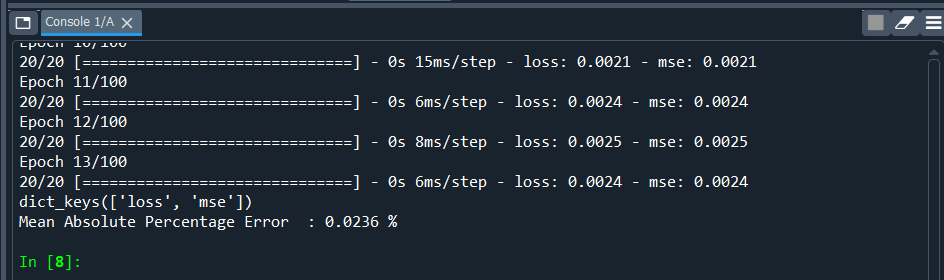

# Covid-19 Daily New Case Prediction
This project is a part of the assessment for SHRDC Data Science course

#### -- Project Status: [Completed]

## Project Intro/Objective
The purpose of this project is to predict the number of daily new cases for covid-19

### Methods Used
* Inferential Statistics
* Deep Learning
* Data Visualization
* Predictive Modeling

### Technologies
* Python
* Pandas, Numpy, Sklearn
* Tensorflow, Tensorboard

## Getting Started

1. Clone this repo (for help see this [tutorial](https://help.github.com/articles/cloning-a-repository/)).
2. Raw Data is retrieved from [https://github.com/nkayfaith/covid19_prediction/tree/main/data] in this repository.
3. Data processing/transformation scripts are being kept [https://github.com/nkayfaith/covid19_prediction/tree/main/model]

## Discussion, Analysis and Result
1. Model Architecture as follows:

A Sequential model with attributes of  embedding_output=64, nodes=32, dropout=0.2, hidden_layer=2 and epochs = 100 with EarlyStopping

2. Training processes recorded as follows:

Process :

Loss :

MSE :

3. Performance of the model and the reports as follows:

Mean Absolute Percentage Error is recorded at :

Predicted vs Actual trend is recorded at :

4. Reviews
#  Reviews
* MAPE recorded at 0.0236%
* Graph shows low loss, low mse which indicates model is good 
* The predicted vs Actual trend shows a good-fit

## Credits
[https://github.com/MoH-Malaysia/covid19-public]
